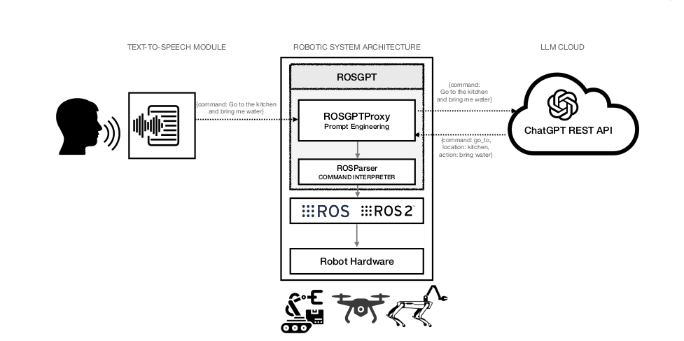
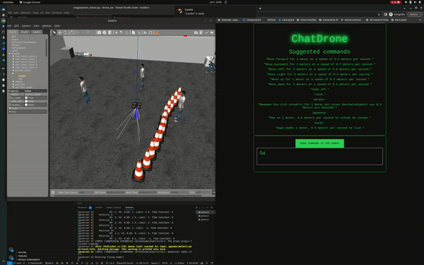
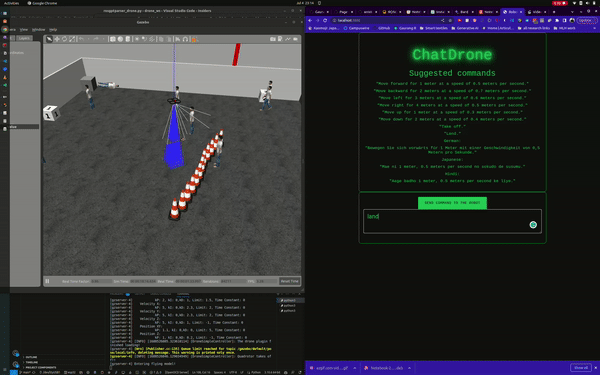

# Voice to Navigation for Quadrotor

Control quadrotor using natural language through a fusion of Large Language Models (LLMs) and ROS2. Translates verbal commands into quadrotor maneuvers using **ROSGPT** architecture.

---

## Table of Contents
- [Architecture](#core-architecture)
- [Model](#model)
- [Key Features](#key-features)
- [Installation](#installation)
- [Usage](#usage)
- [Simulation](#simulation)


---

## Architecture




### Component Pipeline:
1. **ROSGPT Translator** (`rosgpt.py`):
   - REST server converting NL → JSON
   - Implements:
     ```
     prompt = f"Translate '{command}' to drone JSON"
     response = openai.ChatCompletion.create(
         model="gpt-4",
         messages=[{"role": "user", "content": prompt}]
     )
     ```

2. **ROS Client Node** (`rosgpt_client_node.py`):
   - Manages ROS2 ↔ REST API communication

3. **Command Parser** (`rosgptparser_drone.py`):
   - Executes kinematic commands:
     ```
     velocity = {
         'linear': [x, y, z],
         'angular': [roll, pitch, yaw]
     }
     ```

---

## Model

### 1. Natural Language Processing
The translation process uses attention mechanisms from transformer architectures:

$$
\text{Attention}(Q,K,V) = \text{softmax}\left(\frac{QK^T}{\sqrt{d_k}}\right)V
$$

Where:
- $Q$ = Query (input command)
- $K$ = Key (command patterns)
- $V$ = Value (JSON templates)

### 2. Command Probability Distribution
For command $c$ from input $x$ :

$$
P(c|x) = \prod_{t=1}^T P(w_t|w_{t}, x)
$$

Where $w_t$ is the t-th token in the JSON command sequence.

### 3. Drone Kinematics
Translation of velocity commands to motor thrusts:

$$
\begin{bmatrix}
F_1 \\ F_2 \\ F_3 \\ F_4
\end{bmatrix} =
\begin{bmatrix}
1 & 1 & 1 & 1 \\
-l & l & l & -l \\
-l & -l & l & l \\
\tau & -\tau & \tau & -\tau
\end{bmatrix}^{-1}
\begin{bmatrix}
F_z \\ \tau_x \\ \tau_y \\ \tau_z
\end{bmatrix}
$$

Where:
- $F_i$ = Motor thrusts
- $l$ = Arm length
- $\tau$ = Torque coefficient

---

## Key Features

| **Feature** | **Implementation** |
|-------------|--------------------|
| Multilingual Support | GPT-4 Tokenization | 
| Velocity Control | ROS2 Twist Messages |
| Collision Avoidance | Gazebo Depth Sensor |
| Hover Stability | PID Controller |

---

## Installation

```
# Clone repository
mkdir -p ~/ros_ws/src && cd ~/ros_ws/src
git clone https://github.com/iamkrunalrk/Voice-to-Navigation.git

# Install dependencies
cd Voice-to-Navigation
pip3 install -r requirements.txt

sudo apt-get install python-rosdep
sudo rosdep init
rosdep update

cd ~/ros_ws
rosdep install --from-paths src --ignore-src --rosdistro=<rosdistro> -y

# Set OpenAI API key
echo 'export OPENAI_API_KEY="sk-..."' >> ~/.bashrc
```

---

## Usage

### Start Control Stack


### Terminal 1: ROSGPT Translator
```
cd ~/ros_ws
colcon build --symlink-install
```

```
source install/setup.sh
ros2 run rosgpt rosgpt
```

### Terminal 2: Client Node
```
source install/setup.sh
ros2 run rosgpt rosgpt_client_node 
```

### Terminal 3: Command Parser
```
source install/setup.sh
ros2 run rosgpt rosgptparser_drone
```


### Example Commands:
```
1. "go to home and move 2 meters"
2. "Perform a clockwise circle at 3m altitude"
3. "Emergency landing sequence!"
```

---

## Simulation
```
source install/setup.sh
ros2 launch  sjtu_drone_bringup sjtu_drone_bringup.launch.py
```




---
